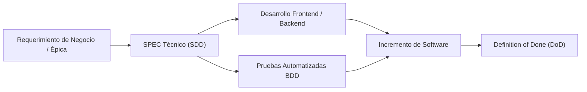

# 🛒 Canal Marketplace Multicanal

> **Taller de Software Web — Grupo 1 (G1)**  
> Plataforma e-commerce multicanal orientada a microservicios desarrollada bajo la metodología **Spec-Driven Development (SDD)**.

---

## 👥 Integrantes del Equipo

A continuación se detalla el equipo de desarrollo, roles y responsabilidades técnicas asignadas en el proyecto:

| # | Integrante | Rol Principal | Módulo / SPEC Asignado |
| :-: | :--- | :--- | :--- |
| 1 | **Espinoza Picón, Diego Steven Martin** | 🧭 Jefe de Proyecto / QA | [`SPEC-06`: Seguimiento e Historial de Pedidos](./SPECS/SPEC-06-EP-SHP-Seguimiento-y-Pedidos.md) |
| 2 | **Garcia Lescano, Leonidas** | 🏛️ Arquitecto de Software | [`SPEC-02`: Vitrina y Exploración del Catálogo](./SPECS/SPEC-02-EP-VEC-Vitrina-y-Exploracion-Catalogo.md) |
| 3 | **Luque Mestanza, Jorge Alonso** | ⚙️ Backend Developer | [`SPEC-08`: Gestión de Favoritos y Lista de Deseos](./SPECS/SPEC-08-EP-FAV-Gestion-de-Favoritos.md) |
| 4 | **Macchiavelo Perez, Giuliano** | 🎨 Diseñador UX/UI & Frontend | [`SPEC-05`: Transacción y Realización de Checkout](./SPECS/SPEC-05-EP-TRX-Checkout-y-Pago.md) |
| 5 | **Malca Agüero, Sebastían Matías** | 📝 Documentador & Frontend | [`SPEC-04`: Carrito de Compras](./SPECS/SPEC-04-EP-ITC-Carrito-y-Favoritos.md) |
| 6 | **Morales Usca, Andres Fernando** | 🔒 DevOps & Seguridad | [`SPEC-01`: Gestión de Accesos del Cliente](./SPECS/SPEC-01-EP-GAC-Gestion-de-Accesos.md) |
| 7 | **Saire Tello, Fernando Jose** | ☁️ QA & Cloud Specialist | [`SPEC-07`: Sistema de Notificaciones](./SPECS/SPEC-07-EP-SNT-Sistema-de-Notificaciones.md) |
| 8 | **Segovia Valencia, Jim Bryan Jordan** | 📋 Product Owner | [`SPEC-03`: Detalle y Disponibilidad de Producto](./SPECS/SPEC-03-EP-DDP-Detalle-y-Disponibilidad-Producto.md) |

---

## 📖 Descripción del Proyecto

El **Canal Marketplace Multicanal** es la interfaz digital y capa de orquestación de comercio electrónico que conecta a clientes finales con el ecosistema de microservicios de la organización (Seguridad, Catálogo de Productos, Ventas, Despacho y Notificaciones).

### Objetivos Clave
- **Experiencia de Usuario Fluida:** Vitrina de productos reactiva, navegación ágil, checkout intuitivo y gestión de lista de deseos.
- **Arquitectura Desacoplada:** Comunicación con servicios externos a través de contratos REST estrictamente tipados y adaptadores de integración (Capa D).
- **Persistencia Aislada:** Cero acceso cruzado a bases de datos ajenas; persistencia local autónoma para sesiones efímeras (carrito y deseos).
- **Garantía de Calidad:** Especificaciones técnicas rigurosas (SDD) acompañadas de escenarios de prueba BDD en formato Gherkin.

---

## 📐 Metodología Spec-Driven Development (SDD)

El proyecto adopta **Spec-Driven Development (SDD)**, donde cada Épica de negocio cuenta con un documento de diseño de software ejecutable (**SPEC**) que actúa como la **única fuente de verdad (*Single Source of Truth*)**.

### Catálogo de Especificaciones Técnicas

| Código | Épica | Nombre de la Especificación | HUs | PH | Responsable | Documento |
| :---: | :---: | :--- | :---: | :---: | :--- | :---: |
| **`SPEC-01`** | `EP-GAC` | Gestión de Accesos del Cliente | 3 | 11 | Andrés Morales | [Ver SPEC](./SPECS/SPEC-01-EP-GAC-Gestion-de-Accesos.md) |
| **`SPEC-02`** | `EP-VEC` | Vitrina y Exploración del Catálogo | 4 | 13 | Leonidas Garcia | [Ver SPEC](./SPECS/SPEC-02-EP-VEC-Vitrina-y-Exploracion-Catalogo.md) |
| **`SPEC-03`** | `EP-DDP` | Detalle y Disponibilidad de Producto | 4 | 11 | Jim Segovia | [Ver SPEC](./SPECS/SPEC-03-EP-DDP-Detalle-y-Disponibilidad-Producto.md) |
| **`SPEC-04`** | `EP-ITC` | Intención de Transacción y Carrito de Compras | 2 | 8 | Sebastián Malca | [Ver SPEC](./SPECS/SPEC-04-EP-ITC-Carrito-y-Favoritos.md) |
| **`SPEC-05`** | `EP-TRX` | Transacción y Realización de Checkout | 3 | 13 | Giuliano Macchiavelo | [Ver SPEC](./SPECS/SPEC-05-EP-TRX-Checkout-y-Pago.md) |
| **`SPEC-06`** | `EP-SHP` | Seguimiento e Historial de Pedidos | 3 | 11 | Diego Espinoza | [Ver SPEC](./SPECS/SPEC-06-EP-SHP-Seguimiento-y-Pedidos.md) |
| **`SPEC-07`** | `EP-SNT` | Sistema de Notificaciones por Correo | 3 | 13 | Fernando Saire | [Ver SPEC](./SPECS/SPEC-07-EP-SNT-Sistema-de-Notificaciones.md) |
| **`SPEC-08`** | `EP-FAV` | Gestión de Favoritos y Lista de Deseos | 3 | 11 | Alonso Luque | [Ver SPEC](./SPECS/SPEC-08-EP-FAV-Gestion-de-Favoritos.md) |
| **TOTAL** | **8 Épicas** | **Solución Integral Marketplace** | **25** | **91** | **8 Integrantes** | [Catálogo SPECS](./SPECS/README.md) |

---

## 🛠️ Stack Tecnológico

| Capa | Tecnologías |
| :--- | :--- |
| **Frontend** | Next.js (App Router), TypeScript, Tailwind CSS, shadcn/ui, TanStack Query, Zustand, React Hook Form, Zod |
| **Backend** | NestJS, TypeScript, class-validator, Axios, Prisma ORM |
| **Persistencia** | PostgreSQL (Dockerizado) / Prisma Schema |
| **Integraciones** | Mock Adapters (`axios-mock-adapter`), Resend Email API, Microservicios externos (Seguridad, Productos, Ventas, Despacho) |
| **Testing & Calidad** | Jest, Supertest, Playwright, Gherkin BDD |

---
## 📋 Convenciones y Contribución

1. **Spec-First:** Antes de implementar cualquier cambio funcional en el código, la modificación debe reflejarse y validarse en su correspondiente documento `SPEC`.
2. **Branching:** Cada integrante trabaja sobre ramas asociadas a su módulo (e.g. `feat/SPEC-0X-nombre-historia`).
3. **Definition of Done:** Cada entrega debe cumplir con los criterios de aceptación BDD, tipado estricto, manejo de errores HTTP y cobertura de pruebas estipulada en su SPEC.
